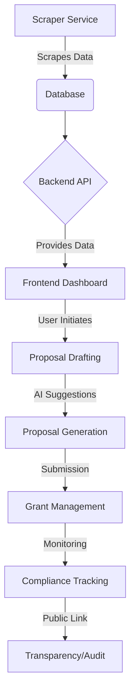

# Grant Management System (GMS) Documentation

Welcome to the comprehensive documentation for the **Grant Management System (GMS)**. This document provides a detailed overview of the system architecture, module workflows, technical stack, and data models.

---

## 1. Project Overview
The Grant Management System (GMS) is a specialized platform designed to automate and streamline the lifecycle of grants. It leverages AI-driven capabilities for grant discovery, proposal generation, and compliance monitoring, facilitating efficient collaboration between funding agencies and grant recipients.

### Key Value Propositions
- **Automated Grant Scraping**: Real-time identification of new grant opportunities.
- **AI-Powered Assistance**: Intelligent proposal drafting and contextual suggestions.
- **Robust Compliance Tracking**: Automated monitoring of grant requirements and public sharing of compliance status.
- **Secure Multi-Tenancy**: Tenant-aware authorization ensuring data isolation and security.

---

## 2. Architecture Overview
The GMS project is built using a modern decoupled architecture consisting of four main components:

- **Frontend (GrantFund Frontend)**: A Vite-powered React application with a responsive Tailwind CSS UI.
- **Backend (GrantFund Backend)**: A Node.js/Express API server connected to a MongoDB database.
- **Grant Scraper**: A Python-based automated scraper (Scrapy) for extracting grant data from external portals.
- **Grant Chatbot**: A standalone Python service providing intelligent conversational assistance.

---

## 3. End-to-End Workflow

### Typical Lifecycle:
1.  **Discovery**: The `Grant Scraper` runs periodically (via Cron) to pull the latest TxDOT and other agency grants into the system.
2.  **Notification & Dashboard**: Users see new opportunities on their `Dashboard`.
3.  **Proposal Drafting**: Users create proposals using the `ProposalDraft` module. The `AI Assistant` (integrated with Groq/Ollama) provides section-by-section suggestions and formatting.
4.  **Financial Tracking**: `Expenses` and `Funds` are tracked against the grant budget.
5.  **Compliance**: Documents are uploaded to meet `ComplianceCheckpoints`. Status can be shared publicly via a secure link.
6.  **Reporting**: Historical data and reports are generated to analyze performance and funding impact.

---

## 4. Module Breakdown

### 🛠️ Core Modules

| Module | Purpose | Key Files |
| :--- | :--- | :--- |
| **Auth** | Manages user registration, login, and JWT-based session handling with tenant isolation. | `authRoutes.js`, `authController.js`, `User.js` |
| **Grants** | Handles the CRUD operations for grant opportunities, including status tracking. | `grantRoutes.js`, `grantController.js`, `Grant.js` |
| **Proposals** | AI-driven module for creating and optimizing grant application drafts. | `aiRoutes.js`, `aiController.js`, `AiSuggestions.jsx` |
| **Compliance** | Ensures all grant requirements are met through checkpoints and document verification. | `complianceRoutes.js`, `ComplianceController.js`, `Compliance.jsx` |
| **Dashboard** | Provides a centralized view of grant statistics, upcoming deadlines, and financial summaries. | `dashboardRoutes.js`, `dashboardController.js`, `Dashboard.jsx` |
| **Expenses** | Tracks spending and allocations against specific funds and grants. | `expenseRoutes.js`, `expenseController.js`, `Expense.js` |
| **Scraper** | Automates the ingestion of external grant data into the local database. | `scraperRoutes.js`, `scraperService.js`, `sync_pipeline.py` |
| **Chatbot** | Provides interactive support to users for navigating the platform and grant queries. | `chatbotRoutes.js`, `chatbot.py`, `GlobalChatbot.jsx` |

---

## 5. Technical Stack

### **Frontend**
- **Framework**: React 18+ (Vite)
- **Styling**: Tailwind CSS, Lucide Icons
- **State Management**: React Context / Hooks
- **Communication**: Axios (Base URL from `.env`)
- **Charts**: Recharts / Chart.js

### **Backend**
- **Runtime**: Node.js
- **Framework**: Express.js
- **Database**: MongoDB (Mongoose ODM)
- **AI Integration**: Groq SDK / Ollama
- **Scheduler**: Node-cron
- **Security**: Helmet, CORS, Argon2 (Hashing), JWT

### **Scraper & Chatbot**
- **Language**: Python 3.x
- **Scraping Framework**: Scrapy
- **Processing**: Pandas (for data normalization)

---

## 6. Data Models (Schema)

| Model | Description |
| :--- | :--- |
| **User** | Store user profiles, roles (Admin, Manager, Subrecipient), and organization details. |
| **Grant** | The central entity containing title, agency, amount, dates, and compliance status. |
| **Proposal** | Drafts of grant applications linked to specific grants and users. |
| **Expense** | Financial records linked to grants and funds for budget tracking. |
| **ComplianceCheckpoint** | Specific requirements that must be satisfied for a grant (e.g., "Upload Tax Form"). |
| **Fund** | Specific pots of money allocated within a grant's total budget. |

---

## 7. Key API Endpoints

- `POST /api/auth/login`: Authenticate user and return token.
- `GET /api/grants`: List all grants (supports filtering by tenant).
- `POST /api/ai/suggest`: Get AI-powered contextual suggestions for a proposal section.
- `GET /api/compliance/status/:grantId`: Retrieve compliance report for a specific grant.
- `POST /api/scraper/sync`: Manually trigger the grant scraper sync.

---

## 8. Setup & Development
To run the full stack locally:

1.  **Backend**: `cd grantfund-backend && npm install && npm start`
2.  **Frontend**: `cd grantfund-frontend && npm install && npm run dev`
3.  **Environment Variables**: Ensure `.env` files in both directories are populated with correct `MONGO_URI`, `GROQ_API_KEY`, and `VITE_API_URL`.

---
*Documentation generated for GMS version 1.0.0*
